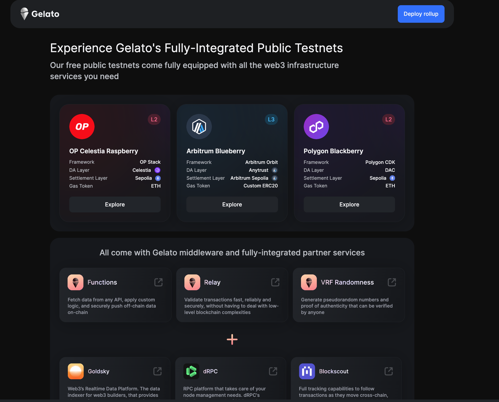
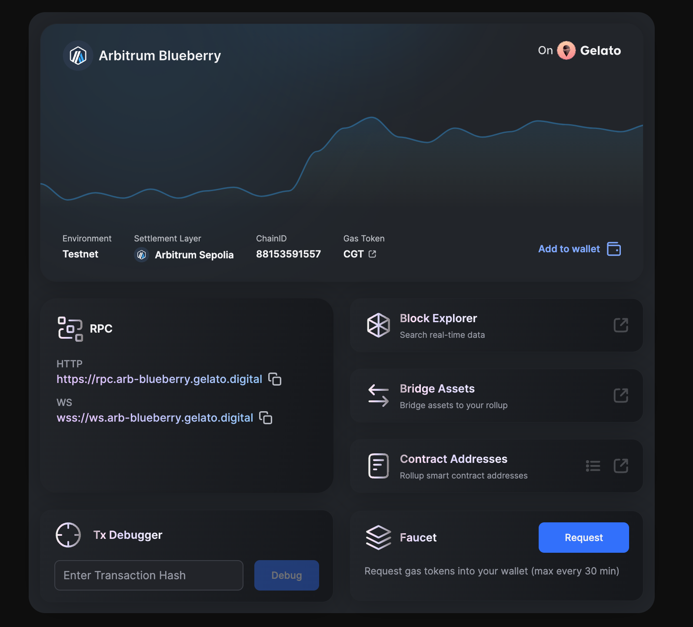
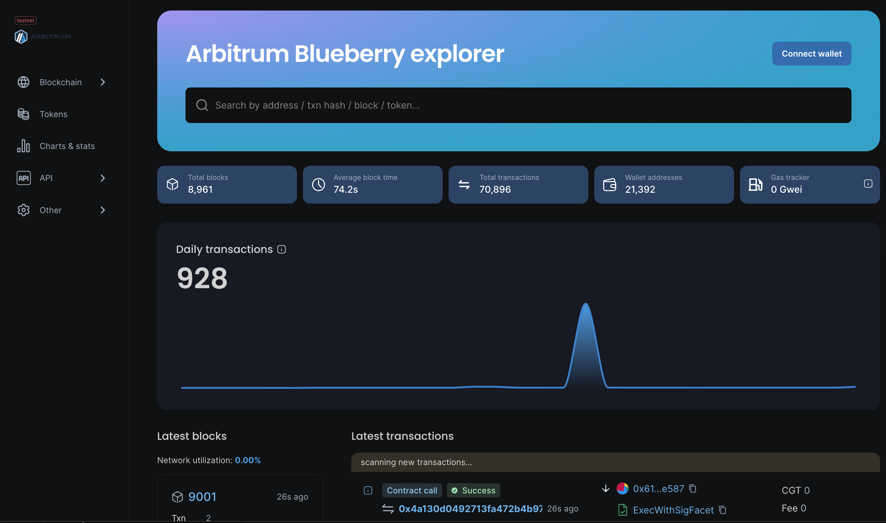
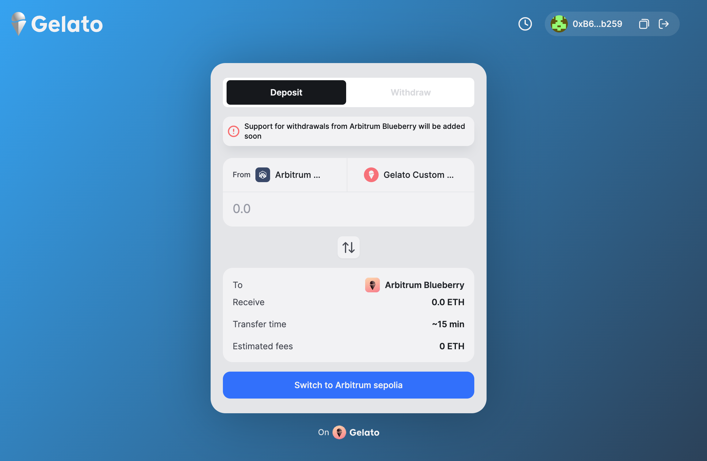

# How To #1 on Gelato: Getting Started with Gelato Public Testnets

Welcom to Blueberry, Raspberry and Blackberry, the Gelato public rollups. In this repo we will speed run hands-on how to develop on this chains.

[](https://youtu.be/GwHKuZRZMQs)


## Chains Info

Please go ahead and visit our [Public testnets Page](https://raas.gelato.network/public-testnets)

  

We can see the current available networks, when chosing one we will go to the rollup overview with the relevant information to get started: chainId, rpc, blockexplorer, etc.. 

  

Clicking on the block explorer you will we redirected to the blockscout instance dor this rollup

  

## Funding

In order to start building we will require test tokens in our rollup, to do so we will need to adquire the respective token (most of the time, native eth, but it can also be a custom gas token) on the setlement layer and then bridge it into the rollup. 
For the L2s that settle on Sepolia we will require to acquire sepEth. Please go to one of these faucets and grab some eth:

- [Alchemy Faucet](https://sepoliafaucet.com/)
- [Infura Faucet](https://www.infura.io/faucet/sepolia)
- [pow Faucet](https://sepolia-faucet.pk910.de/)

For the rollups with a custom tokens like Arbitrum Blueberry we will need to mint it.


Once we have the gas token, we will have to bridge to our rollup. Please login uinto the settlement layer chain and brigde the required amount, it will take up to 15 min depending on the rollup.

  

## Hardhat.config.ts

We need to update our [hardhat.config.ts](./hardhat.config.ts) and iclude our rollups:
```ts
 blueberry: {
      accounts,
      chainId: 88153591557,
      url: `https://rpc.arb-blueberry.gelato.digital`,
    },
    raspberry: {
      accounts,
      chainId: 123420111,
      url: `https://rpc.opcelestia-raspberry.gelato.digital`,
    },
    blackberry: {
      accounts,
      chainId: 94204209,
      url: `https://rpc.polygon-blackberry.gelato.digital`,
    },
```

## Verifying contracts

To verify contracts please follow the [Verifying a Smart Contract](https://docs.blockscout.com/for-users/verifying-a-smart-contract) guide to learn the different options.

In particular, to be able to verify the contracts programatically we will need following steps:

1) Install `@nomiclabs/hardhat-etherscan` package:
```ts
yarn add --dev @nomiclabs/hardhat-etherscan
```

2) Import into `hardhat.config.ts`
```ts
import "@nomiclabs/hardhat-etherscan";n
```

3) Update `hardhat.config.ts` following:

```ts

  etherscan: {
    apiKey: {
      blueberry: "xxx"
    },
    customChains: [
      {
        network: "blueberry",
        chainId: 88153591557,
        urls: {
          apiURL: "https://arb-blueberry.gelatoscout.com/api",
          browserURL: "https://arb-blueberry.gelatoscout.com"
        }
      }
    ]
  },
```